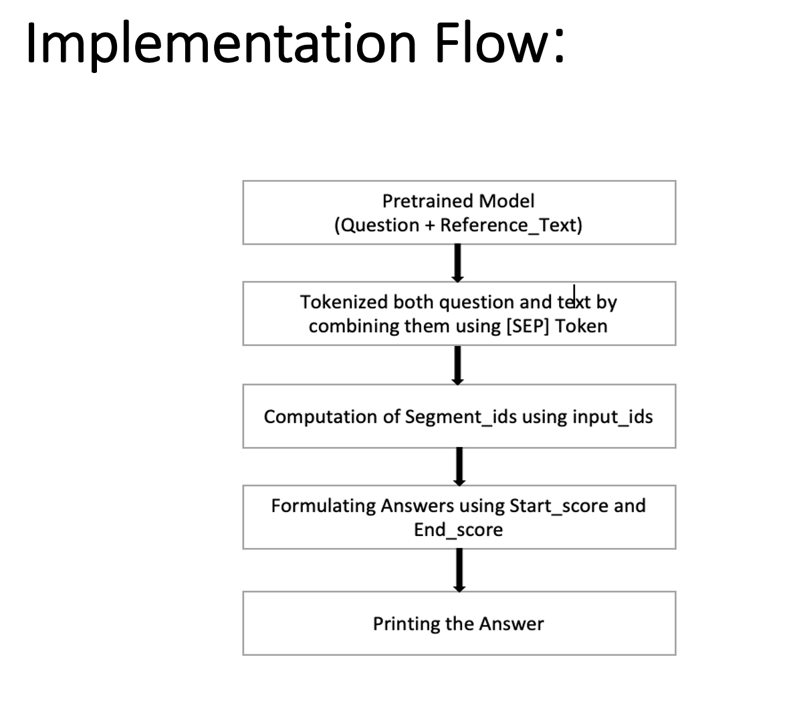
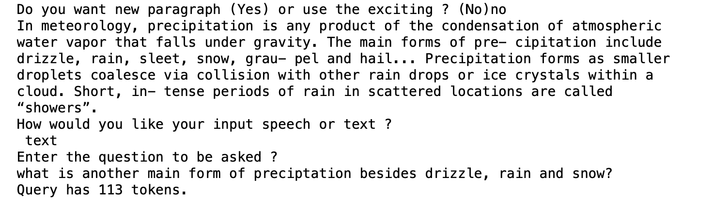
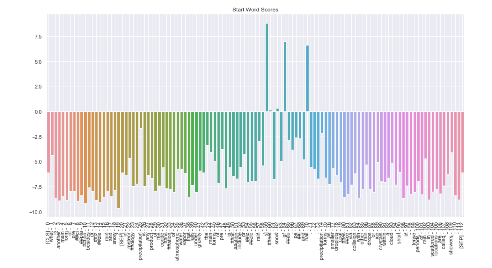
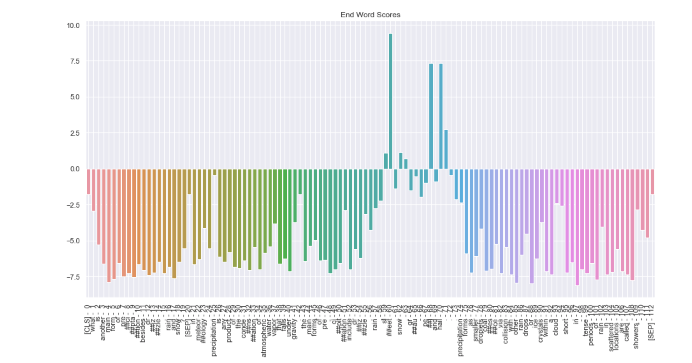
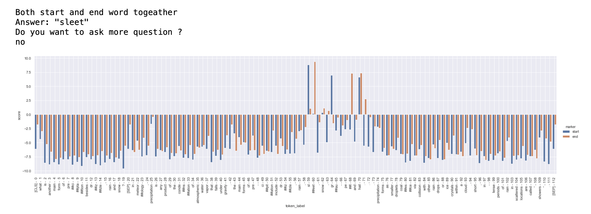

# Q-A-using-Human-Brain-theory
The project focuses on extracting essential elements of a given paragraph, which is implemented by providing questions to the system either by text or speech.

<h3>Models </h3>
<ul style="list-style-type:disc;">
<li>Hugging face transformer Library 
<li>BRET Model :
  <ul style="list-style-type:disc;">
<li>BertForQuestionAnswering 
<li>“bert-large-uncased-whole-word-masking-finetuned-squad”
  </ul>
<li>Bert Tokenizer 
</ul>

<h3>Dataset </h3>
<ul style="list-style-type:disc;">
<li>SQuAD (Stanford Question Answering Dataset)
<li>Answers to questions can be found in referenced text provided.
<li>Every Training and test sample consists of questions and text from passage.
</ul>

<h3>Software Required </h3>
<ul style="list-style-type:disc;">
  <li> Python =3.6
  <li> Pandas
  <li> Matplotlib
  <li> Seaborn
  <li> textwrap3
  <li> pyttsx3
  <li> pyTorch
  <li> SpeechRecognition
  <li> Time
</ul>

<h3> Expected Output </h3>

<h3> Start Word Score </h3>

<h3> End Word Score </h3>

<h3> Start and End Word Score </h3>

